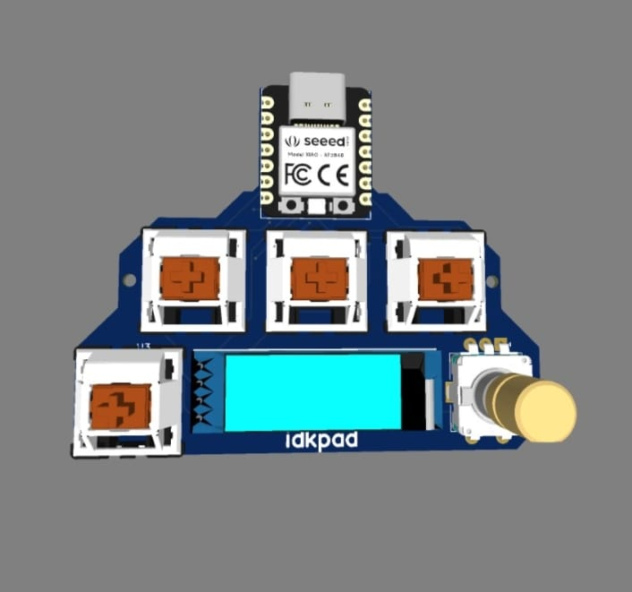

# Idkpad

**Short Description:**  
Idkpad is an open-source hardware project for a customizable mechanical keyboard PCB. This project is fully open source and aims to help both beginners and advanced users build, modify, and understand mechanical keyboard electronics.

---

## Project Documentation

### 3D Render

### PCB Schematic
[Download PCB Schematic](./hardware/idkpad_schematic.pdf)

### Gerber Files
[Download Gerber Files](./hardware/idkpad_gerbers.zip)

---

## 🧾 Bill of Materials (BOM)

| Item                   | Manufacturer / Part No.    | Quantity | Notes                                      |
|------------------------|-----------------------------|----------|--------------------------------------------|
| OLED Display (0.91")   | HS91L02W2C01 / C5248081     | 1        | 0.91" 128x32 OLED, TH mount, from LCSC     |
| Rotary Encoder + Switch| —                           | 1        | Alps-style rotary encoder with push button |
| Seeed XIAO RP2040      | —                           | 1        | Main microcontroller board                 |
| MX Key Switches        | —                           | 4        | Mechanical switches (Cherry MX footprint)  |

---

## Assembly Instructions

1. Gather all components in the BOM.
2. Place and solder.

---

## License

This hardware is released under the CERN-OHL-P v2 (or your chosen license).
See LICENSE file for details.

---

## Support & Contact

- For questions, open an issue or email: abidulhaqahnaf@gmail.com

---

## OSHWA Certification

_Certification UID: (Add your UID if certified, or remove this section if not certified)_
