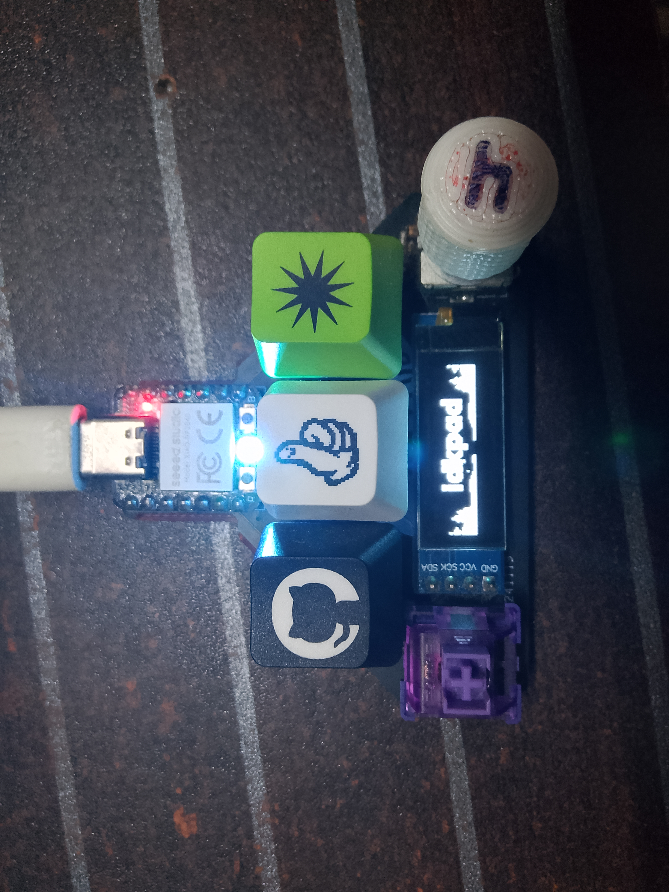

# idkpad

  
*This is the boot logo displayed when the macropad starts up.*

  
*This image shows the current active layer on the macropad. There are 4 layers in total, each of which can be configured separately via Vial.*

---

## Project Documentation

This macropad features 5 keys and supports 4 fully configurable layers through Vial. Each layer allows for unique key mappings, making it versatile for a variety of workflows. The boot logo appears at startup, and the layer indicator helps you identify which layer is currently active.
## Vial Configuration

This macropad is fully compatible with [Vial](https://get.vial.today/), a powerful and user-friendly tool for configuring your keyboard or macropad.  
With Vial, you can:

- Remap any of the 5 keys to any function you like
- Create and switch between 4 different layers
- Set up custom macros and shortcuts
- Instantly update your macropad without reflashing firmware

Simply download Vial, connect your macropad, and start customizing your layout with an intuitive graphical interface.

### 3D View

### PCB Schematic
[Download PCB Schematic](./hardware/idkpad_schematic.pdf)

### Gerber Files
[Download Gerber Files](./hardware/idkpad_gerbers.zip)

---

## 🧾 Bill of Materials (BOM)

| Item                   | Quantity | Notes                                      |
|------------------------|----------|--------------------------------------------|
| OLED Display (0.91")   | 1        | 0.91" 128x32 OLED, TH mount.               |
| Rotary Encoder + Switch| 1        | Alps-style rotary encoder with push button |
| Seeed XIAO RP2040      | 1        | Main microcontroller board                 |
| MX Key Switches        | 4        | Mechanical switches (Cherry MX footprint)  |

## Support & Contact

- For questions, open an issue or email: abidulhaqahnaf@gmail.com

---

## OSHWA Certification

